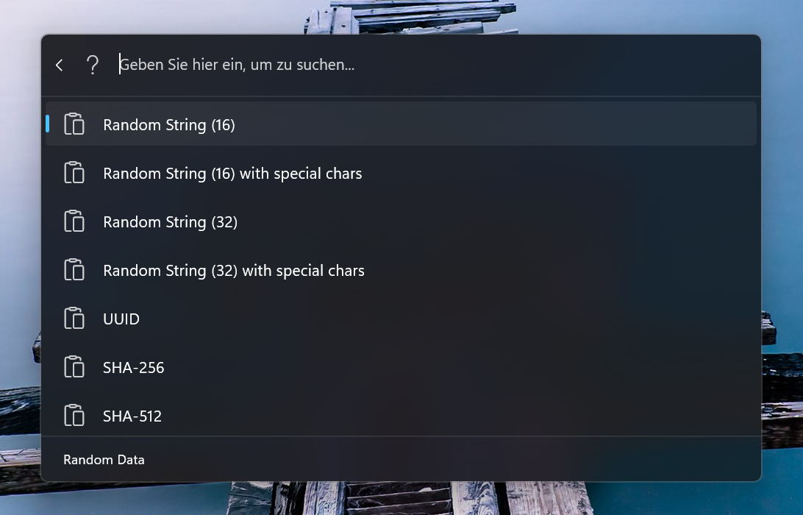

# Command Palette Random Data Generator

## Overview

This project provides a command palette extension for generating random data, including strings, UUIDs, hashes, and Lorem Ipsum text.

## Features

- **Random String Generation**: Generate random strings of specified lengths, with or without special characters.
- **Random Numbers**: Generate random numbers wit a specified number of digits.
- **UUID Generation**: Quickly generate universally unique identifiers (UUIDs).
- **Hash Generation**: Create SHA-256 and SHA-512 hashes of random strings.
- **Lorem Ipsum Text**: Generate Lorem Ipsum text of specified lengths.
- **Dynamic Input**: Enter a number to generate random strings or Lorem Ipsum text of that length.

## Installation

> [!NOTE]  
> Updates may take a few days to be available via WinGet or in the Command Palette.

### Windows Store

### Manual Installation

1. Make sure you use the latest version of PowerToys.
2. Install the application by double-clicking the `.msix` file.

## Usage

- **Default View**: Displays options for generating random strings, UUIDs, hashes, and Lorem Ipsum text.
- **Dynamic Input**: Enter a number (e.g., `16`, `32`, `64`) to generate random strings or Lorem Ipsum text of that length.

## Contributing

Contributions are welcome! If you have suggestions for improvements or new features, please open an issue or submit a pull request.